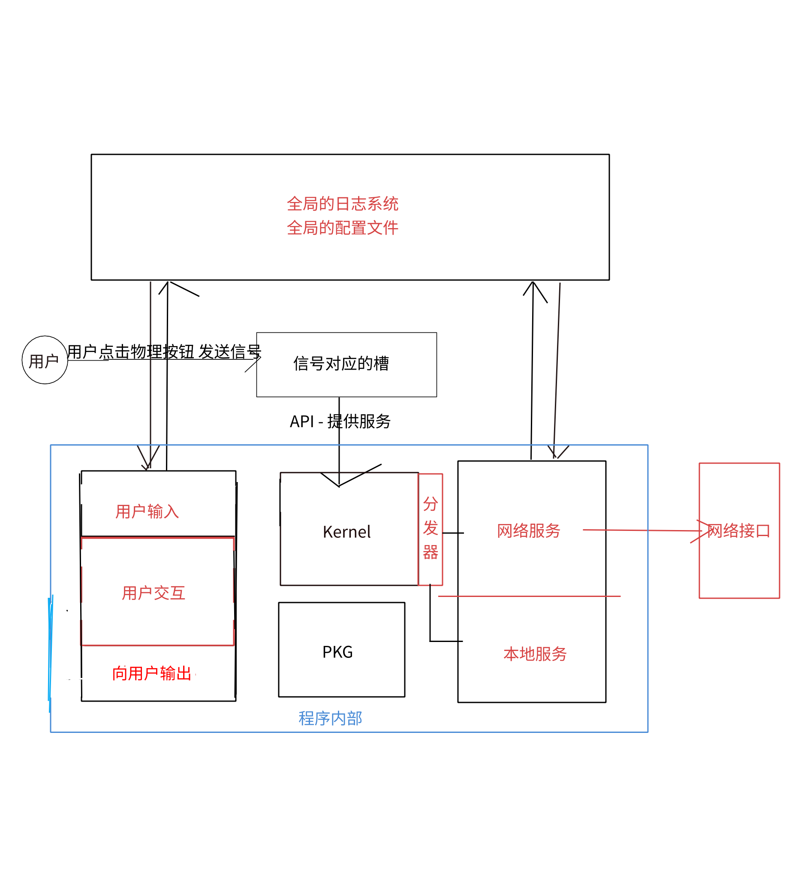

# Home_Care

## 1. 介绍

实现居家养老项目老人端后端

## 2. 实现逻辑和流程图

所有任务通过语音输入
经过处理服务之后转化出对应的关键词
根据关键词分发到不同的服务内容
根据不同的服务内容执行不同的服务

流程图：

## 3. 服务内容

1. 订单生成

## 4. 使用方法

## 5. 目前包含的包

#### 1. File_Filter (PKG)

- 主要目的： 实现文本->关键词
- 提供 API：

  - Deal(src , desc) 从 src 中读取生成到 desc 中

#### 2. Web_service （Service）

- 主要目的： 负责机器人和服务器后端的通讯
- 提供 API：

  - HttpMsg(url , type , info)

#### 3. OrderInfo（Service）

- 主要目的： 生成订单号并且发送到指定的 url（post 方法)
- 提供 API：

  - Deal(src , url) 把 src 中的关键词提取并且生成订单号发送到 url 中

#### 4. User_Interact（User）

- 主要目的： 用现有的关键词去与用户交互进行筛选
- 提供 API：

  - ChooseWords(src , desc):从 src 中读取关键字进行询问 询问后生成到 desc 中

#### 5. User_OutInfo（User）

- 主要目的： 把信息打印到用户终端
- 提供 API：

  - OutInfo(srcfile):从 srcfile 中读取信息并且打印
